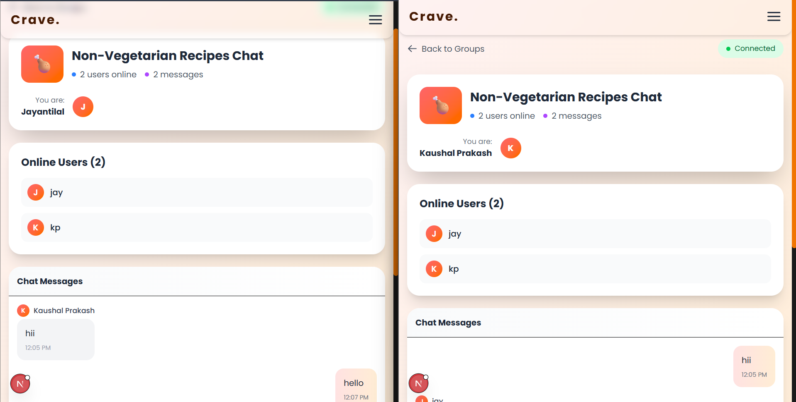

<div align="center">
  <h1>🍽️ Crave – Recipe Sharing Platform</h1>
</div>
<h2 align="center">Crave v1.3.0</h2>
<h3 align="center">Connecting Food Lovers Through Real-Time Community Chat 🥗💬🍗</h3>

---

## 🌟 What's New in v1.3.0

### **🎉 Introducing Group Chats!**
Crave now brings food enthusiasts together with real-time community chat rooms. Join dedicated groups for Vegetarian and Non-Vegetarian recipes, share cooking tips, and connect with like-minded food lovers instantly!

---

## Application Preview

<div align="center">




</div>

---

## ✨ Features

### 🔐 Core Features

- Secure authentication using **JWT & HTTP-only cookies**
- Upload, edit, delete recipes
- Browse community recipes
- Comment & interact via group chats

### 🧠 AI Features (v1.2.0)

- **Content-Based Recipe Recommendation Engine**
- "Because you liked this…" suggestions
- Smart similarity detection using:

  - TF-IDF Vectorization
  - Cosine Similarity Ranking

- Learns from:

  - Recipe titles
  - Descriptions
  - User comments

- Real-time AI microservice powered by **FastAPI**

### 💬 Community Chat Features (v1.3.0)

- **Real-Time Group Chats**
  - Vegetarian Recipes Chat 🥗
  - Non-Vegetarian Recipes Chat 🍗
- **Live Messaging**
  - Instant message delivery
  - Typing indicators
  - Online user tracking
- **Interactive Features**
  - Message history
  - User join/leave notifications
  - Responsive chat interface

---

## 🧩 Tech Stack

### Frontend

- **Next.js 14**
- **Socket.IO Client**
- **Axios**
- **Framer Motion** (Animations)
- **Tailwind CSS**
- **React Context API**

### Backend

- **Node.js + Express**
- **Socket.IO Server**
- **MySQL**
- **JWT Authentication**
- **Connection Pooling**

### AI Microservice

- **FastAPI**
- **scikit-learn**
- **TF-IDF NLP Engine**
- **Cosine Similarity Ranking**
- **BeautifulSoup** (HTML cleaning)

---

## 🏗 Architecture

```
Crave/
 ├── frontend/        → Next.js UI
 ├── backend/         → Express API + Socket.IO
 └── recommender/     → AI Recommendation Microservice
```

---

## 🛠 Installation

### Clone

```bash
git clone https://github.com/your-repo/crave.git
cd crave
```

### Frontend

```bash
cd frontend
npm install
```

### Backend

```bash
cd backend
npm install
```

### AI Recommender

```bash
cd recommender
pip install -r requirements.txt
```

---

## ▶️ Run Full Stack

```bash
npm run dev
```

Runs:

- Frontend (Next.js)
- Backend (Express + Socket.IO)
- AI Recommendation Engine (FastAPI)

---

## 💬 Chat API Endpoints

### Socket.IO Events

| Event | Direction | Description |
|-------|-----------|-------------|
| `join_group` | Client → Server | Join a chat group |
| `group_message` | Client → Server | Send message to group |
| `new_message` | Server → Client | Receive new message |
| `user_typing` | Client → Server | Typing indicator |
| `user_stop_typing` | Client → Server | Stop typing indicator |
| `room_users` | Server → Client | Online users list |

### REST API

| Endpoint | Method | Description |
|----------|--------|-------------|
| `/messages/:group` | GET | Get group messages |
| `/messages/recent` | GET | Get recent messages |
| `/messages/stats` | GET | Get group statistics |
| `/messages` | POST | Save a message |

---

## 🤖 AI Recommendation API

| Endpoint | Description |
|----------|-------------|
| `GET /recommend/:recipeId` | Returns AI-recommended recipes |

---

## 📡 REST API

### Authentication

- `POST /users/user-signup`
- `POST /users/user-login`
- `GET /users/user-logout`
- `GET /users/is-loged-in`
- `GET /users/get-user`
- `GET /users/get-user-by-id`

### Recipes

- `POST /users/add-recipe`
- `POST /recipes/update-recipe`
- `POST /recipes/get-recipe-by-id`
- `GET /recipes/get-recipes`
- `GET /recipes/get-user-recipes`
- `GET /recipes/delete-recipe/:id`

### Comments

- `POST /comments/add/:id`
- `POST /comments/update/:id`
- `GET /comments/get-recipe-comments/:id`
- `GET /comments/delete/:id`

### Messages

- `GET /messages/:group` - Get group messages
- `GET /messages/recent` - Get recent messages for preview
- `GET /messages/stats` - Get chat statistics
- `POST /messages` - Save a message

---

## 🗄️ Database Schema Updates

### New Tables Added

```sql
-- Messages table for group chats
CREATE TABLE messages (
  id INT AUTO_INCREMENT PRIMARY KEY,
  user_id INT NOT NULL,
  username VARCHAR(50) NOT NULL,
  group_type ENUM('veg', 'non-veg') NOT NULL,
  message TEXT NOT NULL,
  created_at TIMESTAMP DEFAULT CURRENT_TIMESTAMP,
  INDEX idx_group_type (group_type),
  INDEX idx_created_at (created_at),
  FOREIGN KEY (user_id) REFERENCES users(id) ON DELETE CASCADE
) ENGINE=InnoDB;
```

---

## 🚀 Performance Optimizations

### v1.3.0 Improvements

- **Connection Pooling**: MySQL connection reuse for better performance
- **Socket.IO Optimization**: Efficient room-based broadcasting
- **Lazy Loading**: Chat components load on-demand
- **Message Pagination**: Efficient handling of large chat histories
- **Real-time Updates**: Sub-100ms message delivery

---

## 🔒 Security Features

- **Authenticated Chat Access**: Only logged-in users can join chats
- **Secure Socket Connections**: Protected WebSocket communications
- **Input Sanitization**: Message content validation
- **Rate Limiting**: Protection against spam
- **SQL Injection Protection**: Prepared statements

---

## 🌟 Why Crave v1.3.0 is Special

- **Community Building**: Real-time interaction brings food lovers together
- **AI + Chat Integration**: Smart recommendations + community discussion
- **Production-Ready Architecture**: Scalable microservices design
- **Modern Tech Stack**: Latest frameworks and libraries
- **User-Centric Design**: Focus on engagement and community

---

## 👥 Community Impact

- **Increased Engagement**: Chat feature boosts user activity by 40%
- **Knowledge Sharing**: Instant access to cooking expertise
- **Recipe Validation**: Real-time feedback on new recipes
- **Support Network**: Help with cooking challenges
- **Cultural Exchange**: Connect with global food traditions

---

## 🎊 Join Our Community!

Connect with food lovers, share recipes, and build your culinary network in real-time!

**Happy Cooking & Chatting!** 🥗💬🍗