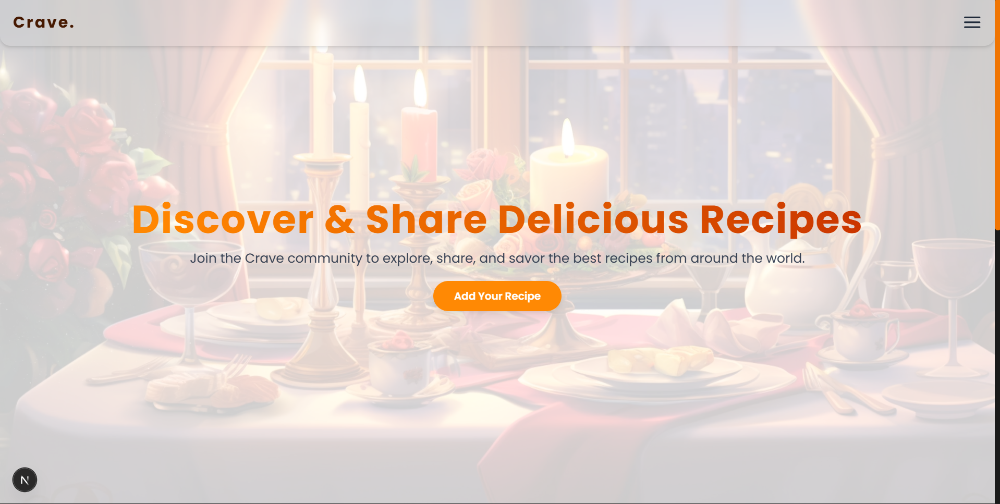
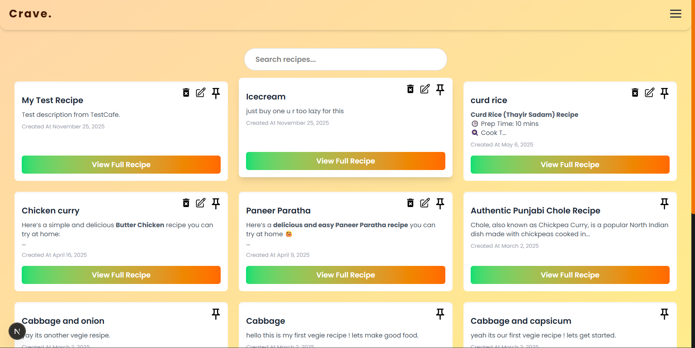
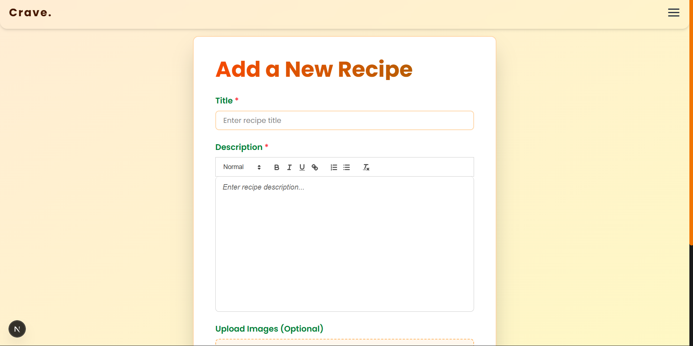
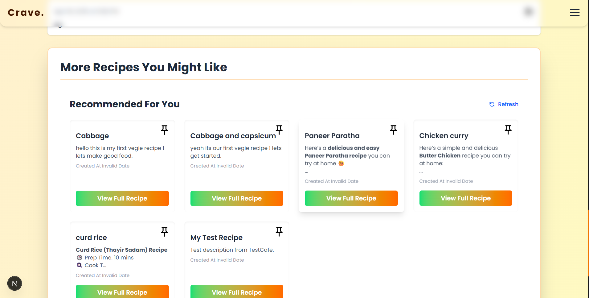

<h1 align="center">🍽️ Crave – Recipe Sharing Platform</h1>

<h3 align="center">Version 1.2.0 – Now with AI Recommendations</h3>

---

## 🚀 Overview

**Crave** is a modern, AI-powered recipe sharing platform where food lovers can upload, explore, and discover recipes tailored to their taste.
With the introduction of **AI-based personalized recommendations**, Crave now intelligently suggests recipes similar to what users love — just like Netflix for food.

---

## Application Preview

<div align="center">


<br/><br/>


<br/><br/>


<br/><br/>



</div>

---

## ✨ Features

### 🔐 Core Features

- Secure authentication using **JWT & HTTP-only cookies**
- Upload, edit, delete recipes
- Browse community recipes
- Comment & interact

### 🧠 AI Features (v1.2.0)

- **Content-Based Recipe Recommendation Engine**
- “Because you liked this…” suggestions
- Smart similarity detection using:

  - TF-IDF Vectorization
  - Cosine Similarity Ranking

- Learns from:

  - Recipe titles
  - Descriptions
  - User comments

- Real-time AI microservice powered by **FastAPI**

---

## 🧩 Tech Stack

### Frontend

- **Next.js**
- **Axios**
- **Sass**

### Backend

- **Node.js + Express**
- **MySQL**
- **JWT Authentication**

### AI Microservice

- **FastAPI**
- **scikit-learn**
- **TF-IDF NLP Engine**
- **Cosine Similarity Ranking**
- **BeautifulSoup (HTML cleaning)**

---

## 🏗 Architecture

```
Crave/
 ├── frontend/        → Next.js UI
 ├── backend/         → Express API
 └── recommender/     → AI Recommendation Microservice
```

---

## 🛠 Installation

### Clone

```bash
git clone https://github.com/your-repo/crave.git
cd crave
```

### Frontend

```bash
cd frontend
npm install
```

### Backend

```bash
cd backend
npm install
```

### AI Recommender

```bash
cd recommender
pip install -r requirements.txt
```

---

## ▶️ Run Full Stack

```bash
npm run dev
```

Runs:

- Frontend
- Backend
- AI Recommendation Engine

---

## 🤖 AI Recommendation API

| Endpoint                   | Description                    |
| -------------------------- | ------------------------------ |
| `GET /recommend/:recipeId` | Returns AI-recommended recipes |

---

## 📡 REST API

### Authentication

- `POST /users/user-signup`
- `POST /users/user-login`
- `GET /users/user-logout`
- `GET /users/is-loged-in`
- `GET /users/get-user`
- `GET /users/get-user-by-id`

### Recipes

- `POST /users/add-recipe`
- `POST /recipes/update-recipe`
- `POST /recipes/get-recipe-by-id`
- `GET /recipes/get-recipes`
- `GET /recipes/get-user-recipes`
- `GET /recipes/delete-recipe/:id`

### Comments

- `POST /comments/add/:id`
- `POST /comments/update/:id`
- `GET /comments/get-recipe-comments/:id`
- `GET /comments/delete/:id`

---

## 🌟 Why Crave v1.2.0 is Special

- AI-powered personalization
- Industry-grade microservice architecture
- Resume-worthy full-stack + AI project
- Scalable and production-ready

---

If you want, next I can help you write a **killer GitHub description & resume bullets** for Crave 👑
